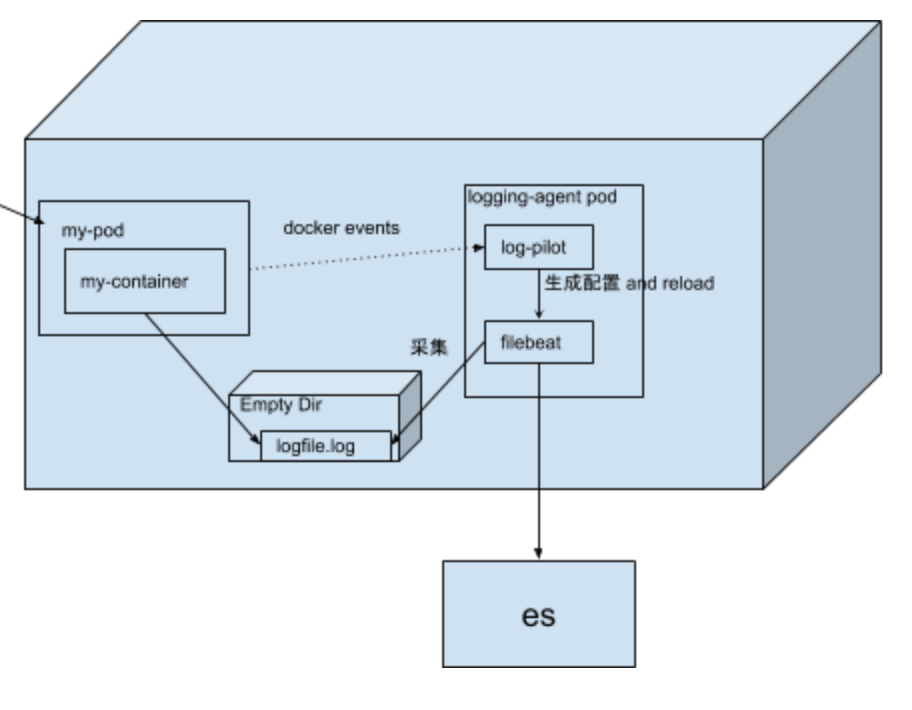

<!-- START doctoc generated TOC please keep comment here to allow auto update -->
<!-- DON'T EDIT THIS SECTION, INSTEAD RE-RUN doctoc TO UPDATE -->
**Table of Contents**  *generated with [DocToc](https://github.com/thlorenz/doctoc)*

- [log-pilot](#log-pilot)

<!-- END doctoc generated TOC please keep comment here to allow auto update -->

log-pilot
=========

Log-pilot is a rewrite of [log-pilot](https://github.com/AliyunContainerService/log-pilot), thanks its awesome idea to run filebeat/fluentd as a sidecar and let log-pilot do container log discovery and manage configurations.
Log-pilot only support filebeat for easier maintaince and better performance. Also, filebeat is more cloud native than fluentd.

The architecture described as bellow

